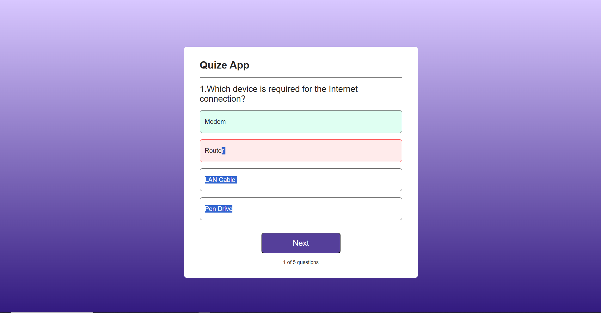

# 🎯 Quiz App

An **interactive Quiz Application** built with **React.js**.  
It allows users to answer multiple-choice questions, get instant feedback on answers, track their score, and navigate through questions with a clean UI.

---

## 🚀 Features
- 📌 Multiple-choice questions with dynamic rendering  
- 📌 Instant feedback (Correct/Wrong answer highlighting)  
- 📌 “Next” button to navigate through questions  
- 📌 Question counter with progress tracking  
- 📌 **Score counter** to track correct answers throughout the quiz  
- 📌 Responsive and user-friendly UI with custom CSS  
- 📌 Built using React Hooks (`useState`, `useRef`)  
- 📌 Bundled with **Webpack** for scalability and performance  

---

## 🛠️ Tech Stack
- **React.js** – Frontend framework  
- **JavaScript (ES6+)** – Core logic  
- **CSS3** – Styling  
- **Webpack** – Module bundler  

---

## 📸 Screenshots


```md

